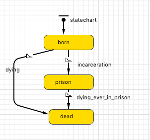

I created a simple simulation using this generative process:  

#

I am using life table age-specific mortality rates, the US age population distribution, and a constant imprisonment rate equals to 0.007 between ages 18 and 45, otherwise that rate is 0. Being in prison increases age-specific mortality rates by 1.90. 

I generated 1000 samples using 10,000 individuals. Individuals enter to the observation window at different ages (based on the US age distribution) and  right censoring is defined using a uniform distribution (`censoring = uniform(age_enter, 120)`)

```{r, include=FALSE}
library(sdazar)
library(survival)
library(texreg)
library(eha)

dat <- fread("~/Desktop/incarcerationABM/output.csv")
length(table(dat$rep)) # high correlation between enter and censoring


# 500 replicates
coefvar <- NULL
coefvar2 <- NULL

maxrep <- 500

for (i in 1:maxrep) {
 
 tdat <- dat[rep == i]  
 tdat[, exit := ifelse(agedeath > censored, censored, agedeath)]
 tdat[ageprison > exit, ageprison := 0]
 tdat[ageprison < enter, ageprison := 0] # under estimation
 tdat[, select := ifelse(exit > enter, 1, 0)] # they entered and then they can die
 # table(tdat$select)
 tdat[, event := ifelse(agedeath == exit, 1, 0)] # deaths
 tdat <- tdat[select == 1]
 tdat[, prison := ifelse(ageprison > 0, 1, 0)] # people with prison experiences after selection cases not valid
 table(tdat$prison)
 tdat[, start := 0]
 tdat[, stop := exit - enter] # observation time
 tdat[, event := ifelse(exit == agedeath, 1, 0)]
 table(tdat$event, useNA = "ifany")
 tdat[ageprison > 0, tprison := ageprison - enter] # observation time for prison
 summary(tdat$tprison)
 tdat[, age := enter]
 
 # split dataset
 tdat[, count := ifelse(ageprison > 0, 2, 1)]
 tdat <- tdat[rep(seq(1, nrow(tdat)), tdat$count)] # expand data
 tdat[, s := 1:.N, id]
 
 tdat[count == 1, vprison := 0]
 tdat[count == 2 & s == 1, stop := tprison]
 tdat[count == 2 & s == 2, start := tprison]
 tdat[count == 2 & s == 2, vprison := 1]
 tdat[count == 2 & s == 1, vprison := 0]
 tdat[event == 1 & count == 2 & s == 1, event := 0]
 
 tdat[count == 2, .(id, age, start, stop, event, vprison)]

 m1 <- coxph(Surv(start, stop, event) ~ vprison + age, data = tdat) 
 coefvar <- c(coefvar,exp(coef(m1)[1]))
 
 tdat
 m2 <- coxph(Surv(start, stop, event) ~ vprison, data = tdat) 
 coefvar2 <- c(coefvar2, exp(coef(m2)[1]))

}
```

The average enter age (in all simulations) is `r round(median(dat$enter), 2)` and its distribution:

```{r}
hist(dat$enter, xlab = "Age start observation", main = "Distribution age start observation")
hist(dat$censored, xlab = "Age censoring", main = "Distribution age censoring")
```
The survival plot of one of the simulations (remember using the observation window, not age): 

```{r, echo = FALSE}
plot(survfit(Surv(tdat$start, tdat$stop, tdat$event) ~ 1))
```
I run 1000 Cox models adjusting by a time-varying prison variable (only 1s after the incarceration transition occurs), that is, there is a split in the data when incarceration takes place, and I also adjust by age (start and stop times represent the observation window, not age, as in our analysis of PSID and NLSY). The key event is death. Below an example of the data setup.

```{r, echo=FALSE}
ids <- unique(tdat[count == 2, id])
tdat[id == sample(ids, 1), .(id, start, stop, age, vprison, event)]
```

I get this distribution of hazard ratios for the time-varying variable *prison*:

```{r, echo=FALSE}
hist(coefvar, xlab = "Incarceration Hazard Ratio Estimates")
```

The mean of hazard ratios is `r round(mean(coefvar), 3)`. The estimate is rather close to 1.90. The data setup I am using for the analysis of PSID and NLSY is correct. 

There are some differences: in this example I am using continous time, but our data have years, and I create a record for every year observed. I guess ties do not have huge effects on our esimates.
